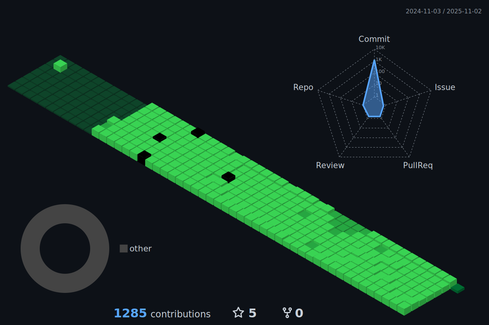

<!-- ### Hello, my name is Luigi Sousa -->


<p align="center">
  </a>
</p>

[](https://git.io/typing-svg)

<p align="center">
    <a href="https://github.com/LuigiSousaa?tab=repositories">
      
    </a>
    <a href="https://github.com/LuigiSousaa?tab=followers">
      
    </a>
    </a>
</p>

<div align="center">
   
  
</div>

<p align="center">
    
</p>

##

  ```yaml
  name: Luigi Sousa
  located_in: Limeira, São Paulo (Brazil)
  job: Mobile Application Developer
  education: ["Computer Science": "UNIP", "System Developing": "SENAI"]
  past_experiences:
    - ["Mobile Application Developer Competitor", "Worldskills", "São Paulo Skills", "SENAI", "Brazil", "23/24"]
    - ["Systems Development Technician", "Lume Cerâmica", "Brazil", "2024"]
    - ["Junior Java Programmer", "Alpha7 Desenvolvimento de Software", "Brazil", "2025"]

  fields_of_interests: ["Network Security", "Cryptography", "Blockchain", "Digital Forensics", "Cyber Risk Management",
                        "Cloud Security", "Software as a Service", "Microservices Architecture"]
  currently_learning: ["Operating Systems", "Cybersecurity Concepts", "Software Architectures", "Data Analysis", 
                       "Database Management", "Back-end Frameworks"]
  will_learn: ["Cybersecurity"]
  ```

<details open>
  <summary><h2>📊 Github Stats and Activity</h2></summary>

  <h3>💻 GitHub Profile Stats</h3>
  <p align="center">
    <a href="https://github.com/LuigiSousaa">
      <source media="(prefers-color-scheme: light)" srcset="src/images/profile-3d/profile-night-rainbow.svg" width = "98%">
      
    </a>
  </p>  

<br>

<a href="https://github.com/LuigiSousaa"></a>

<!--START_SECTION:activity-->
<!--END_SECTION:activity-->
</details>

<details open> 
  <summary><h2>🛠️ My Favorite Tools</h2></summary>
  <!-- Some badges are from https://github.com/Ileriayo/markdown-badges -->

  <h3>👨‍💻 Programming Languages</h3>

  <p>
      <a href="https://www.java.com/"></a>
      <a href="https://www.javascript.com/"></a>
      <a href="https://www.php.net/"></a>
      <a href="https://kotlinlang.org/docs/home.html"></a>
      <a href="https://dart.dev/docs"></a>
  </p>

  <h3>🧰 Frameworks</h3>

  <p>
      <a href="https://flutter.dev/"></a>
      <a href="https://spring.io/projects/spring-boot"></a>
      <a href="https://laravel.com/"></a>
  </p>

  <h3>🗄️ Databases</h3>

  <p>
      <a href="https://www.mysql.com/"></a>
      <a href="https://www.postgresql.org/"></a>
      <a href="https://firebase.google.com/"></a>
  </p>

  <h3>💻 Software and Tools</h3>

<p>
    <a href="https://git-scm.com/"></a>
    <a href="https://www.postman.com/"></a>
    <a href="https://developer.android.com/"></a>
    <a href="https://code.visualstudio.com/"></a>
    <a href="https://www.figma.com/"></a>
    <a href="https://trello.com/"></a>
    <a href="https://www.notion.so/"></a>
    <a href="https://discord.com/"></a>
</p>

</details>

<div align="center">
    <br><br><br><br><br><br><p align="centre"><b>count++ </b></p>  
    <p align="center"></p> 
    <br>
  </div>

##

<div>
  <h3 align="center">🌎 Find me around the web</h3>
  <p align="center">
  <a href="https://www.linkedin.com/in/luigisousaa/" target="_blank"></a> 
  <a href = "https://mail.google.com/mail/?view=cm&fs=1&to=luigisousaa@gmail.com"></a>
  </p>
</div>  
